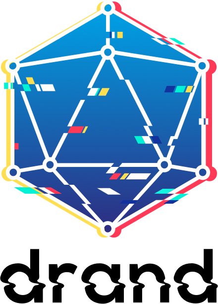

# Drand - A Distributed Randomness Beacon Daemon

<p align="center"></p>

<p align="center">
  <a href="https://circleci.com/gh/drand/drand/tree/master" title="CircleCI"></a>
  <a href="https://codecov.io/gh/drand/drand" title="Coverage"></a>
  <a href="https://goreportcard.com/report/github.com/drand/drand" title="Go Report Card"></a>
  <a href="https://pkg.go.dev/github.com/drand/drand" title="go.dev reference"></a>
  <a href="https://golang.org/" title="golang version"></a>
</p>

<p align="center">
Drand (pronounced "dee-rand") is a distributed randomness beacon daemon 
written in <a href="https://golang.org/">Golang</a>.
</p>

<p align="center">
Linked drand nodes collectively produce <strong>publicly verifiable</strong>,
<strong>unbiased</strong> and <strong>unpredictable</strong> random values at
fixed intervals using bilinear pairings and threshold cryptography.
</p>

<p align="center">
Drand was first developed within the <a href="https://github.com/dedis">DEDIS
organization</a>, and as of December 2019, is now under the drand organization.
</p>

<!-- START doctoc generated TOC please keep comment here to allow auto update -->
<!-- DON'T EDIT THIS SECTION, INSTEAD RE-RUN doctoc TO UPDATE -->
## Table of Contents

- [Goal and Overview](#goal-and-overview)
  - [Public Randomness](#public-randomness)
  - [Private Randomness](#private-randomness)
- [Installation](#installation)
  - [Official release](#official-release)
  - [Manual installation](#manual-installation)
  - [Via Golang](#via-golang)
  - [Via Docker](#via-docker)
- [Usage](#usage)
  - [Run Drand locally](#run-drand-locally)
  - [Create a Drand deployment](#create-a-drand-deployment)
  - [Fetching Public Randomness](#fetching-public-randomness)
  - [Fetching Private Randomness](#fetching-private-randomness)
  - [Using HTTP endpoints](#using-http-endpoints)
  - [JavaScript client](#javascript-client)
- [Documentation](#documentation)
- [What's Next?](#whats-next)
- [Acknowledgments](#acknowledgments)
- [Coverage](#coverage)
- [License](#license)

<!-- END doctoc generated TOC please keep comment here to allow auto update -->

## Goal and Overview
The need for digital randomness is paramount in multiple digital applications
([e]voting, lottery, cryptographic parameters, embedded devices bootstrapping
randomness, blockchain systems etc) as well in non-digital such as statistical
sampling (used for example to check results of an election), assigning court
cases to random judges, random financial audits, etc.  However, constructing a
secure source of randomness is nothing but easy: there are countless examples
of attacks where the randomness generation was the culprit (static keys,
non-uniform distribution, biased output, etc).  drand aims to fix that gap by
providing a Randomness-as-a-Service network (similar to NTP servers for time,
or Certificate Authority servers for CAs verification), providing continuous
source of randomness which is:

* Decentralized: drand is a software ran by a diverse set of reputable entities
  on the Internet and a threshold of them is needed to generate randomness,
  there is no central point of failure. 
* Publicly verifiable & unbiased: drand periodically delivers publicly
  verifiable and unbiased randomness. Any third party can fetch and verify the
  authenticity of the randomness and by that making sure it hasn't been
  tampered with.
* And "private" as well: drand nodes can also deliver encrypted randomness 
  to be used in a local applications, for example to seed the OS's PRNG.

A drand network is operated by a group of organizations around the world that 
includes Cloudflare, EPFL, Kudelski Security, Protocol Labs, Celo, UCL, and 
UIUC. You can learn more by visiting the 
[League of Entropy website](https://leagueofentropy.com), where you can also
see the random values being generated by the network in real time.

### Public Randomness
Generating public randomness is the primary functionality of drand. Public
randomness is generated collectively by drand nodes and publicly available. The
main challenge in generating good randomness is that no party involved in the
randomness generation process should be able to predict or bias the final
output. Additionally, the final result has to be third-party verifiable to make
it actually useful for applications like lotteries, sharding, or parameter
generation in security protocols.

A drand randomness beacon is composed of a distributed set of nodes and has two
phases:

- **Setup:** Each node first generates a *long-term public/private key pair*.
  Then all of the public keys are written to a *group file* together with some
  further metadata required to operate the beacon. After this group file has
  been distributed, the nodes perform a *distributed key generation* (DKG)
  protocol to create the collective public key and one private key share per
  server. The participants NEVER see/use the actual (distributed) private key
  explicitly but instead utilize their respective private key shares for the
  generation of public randomness.
- **Generation:** After the setup, the nodes switch to the randomness
  generation mode. Any of the nodes can initiate a randomness generation round
  by broadcasting a message which all the other participants sign using a
  t-of-n threshold version of the *Boneh-Lynn-Shacham* (BLS) signature scheme
  and their respective private key shares. Once any node (or third-party
  observer) has gathered t partial signatures, it can reconstruct the full BLS
  signature (using Lagrange interpolation). The signature is then hashed using
  SHA-512 to ensure that there is no bias in the byte representation of the
  final output. This hash corresponds to the collective random value and can be
  verified against the collective public key.

### Private Randomness
Private randomness generation is the secondary functionality of drand. Clients
can request private randomness from some or all of the drand nodes which
extract it locally from their entropy pools and send it back in encrypted form.
This can be useful to gather randomness from different entropy sources, for
example in embedded devices.

In this mode we assume that a client has a private/public key pair and
encapsulates its public key towards the server's public key using the ECIES
encryption scheme. After receiving a request, the drand node produces 32 random
bytes locally (using Go's `crypto/rand` interface), encrypts them using the
received public key and sends it back to the client.

**Note:** Assuming that clients without good local entropy sources (such as
embedded devices) use this process to gather high entropy randomness to
bootstrap their local PRNGs, we emphasize that the initial client key pair has
to be provided by a trusted source (such as the device manufacturer). Otherwise
we run into the chicken-and-egg problem of how to produce on the client's side
a secure ephemeral key pair for ECIES encryption without a good (local) source
of randomness.

## Installation

### Official release
Please go use the latest drand binary in the [release page](https://github.com/drand/drand/releases).

### Manual installation
Drand can be installed via [Golang](https://golang.org/) or
[Docker](https://www.docker.com/). By default, drand saves the configuration
files such as the long-term key pair, the group file, and the collective public
key in the directory `$HOME/.drand/`.

### Via Golang
Make sure that you have a working [Golang
installation](https://golang.org/doc/install) and that your
[GOPATH](https://golang.org/doc/code.html#GOPATH) is set.

Then install drand via:
```bash
git clone https://github.com/drand/drand
cd drand
make install
```

### Via Docker
The setup is explained in
[docker/README.md](https://github.com/drand/drand/tree/master/docker/README.md).

## Usage

### Run Drand locally

To run a local demo, you can simply run:
```bash
make demo
```

The script spins up a few drand local processes, performe resharing and other
operations and will continue to print out new randomness every Xs (currently
6s).
For more information, look at the demo [README](https://github.com/drand/drand/tree/master/demo).


A drand beacon provides several public services to clients. A drand node
exposes its public services on a gRPC endpoint as well as a REST JSON endpoint,
on the same port. The latter is especially useful if one wishes to retrieve
randomness from a JavaScript application.  Communication is protected through
TLS by default. If the contacted node is using a self-signed certificate, the
client can use the `--tls-cert` flag to specify the server's certificate.

### Create a Drand deployment

Consult full instructions at [DEPLOYMENT](https://beta.drand.love/operator/deploy/)

### Fetching Public Randomness

To get the latest public random value, run
```bash
drand get public --round <i> <group.toml>
```
where `<group.toml>` is the group identity file of a drand node. You can
specify the round number when the public randomness has been generated. If not
specified, this command returns the most recent random beacon.

The JSON-formatted output produced by drand is of the following form:
```json
{
  "round": 367,
  "signature": "b62dd642e939191af1f9e15bef0f0b0e9562a5f570a12a231864afe468377e2a6424a92ccfc34ef1471cbd58c37c6b020cf75ce9446d2aa1252a090250b2b1441f8a2a0d22208dcc09332eaa0143c4a508be13de63978dbed273e3b9813130d5",
  "previous_signature": "afc545efb57f591dbdf833c339b3369f569566a93e49578db46b6586299422483b7a2d595814046e2847494b401650a0050981e716e531b6f4b620909c2bf1476fd82cf788a110becbc77e55746a7cccd47fb171e8ae2eea2a22fcc6a512486d",
  "randomness": "d7aed3686bf2be657e6d38c20999831308ee6244b68c8825676db580e7e3bec6"
}
```

Here `Signature` is the threshold BLS signature on the previous signature value
`Previous` and the current round number. `Randomness` is the hash of
`Signature`, to be used as the random value for this round. The field `Round`
specifies the index of `Randomness` in the sequence of all random values
produced by this drand instance. The **message signed** is therefore the
concatenation of the round number treated as a `uint64` and the previous
signature. At the moment, we are only using BLS signatures on the bls12-381 curves
and the signature is made over G1.

### Fetching Private Randomness
To get a private random value, run the following:

```bash
drand get private group.toml
```
The JSON-formatted output produced by drand should look like the following:

```bash
{
    "Randomness": "764f6e3eecdc4aba8b2f0119e7b2fd8c35948bf2be3f87ebb5823150c6065764"
}
```

The command outputs a 32-byte hex-encoded random value generated from the local
randomness engine of the contacted server. If the encryption is not correct,
the command outputs an error instead.

### Using HTTP endpoints
One may want get the distributed key or public randomness by issuing a GET to a
HTTP endpoint instead of using a gRPC client. Here is a basic example on how to
do so with curl.

To get the distributed key, you can use:
```bash
curl <address>/group
```

Similarly, to get the latest round of randomness from the drand beacon, you can
use
```bash
curl <address>/public/latest
```

### JavaScript client

To facilitate the use of drand's randomness in JavaScript-based applications,
we provide [`drand-client`](https://github.com/drand/drand-client).

For more details on the procedure and instructions on how to use it,
refer to the
[readme](https://github.com/drand/drand-client/blob/master/README.md).

## Documentation

Here is a list of all documentation related to drand: 

- To learn more about the protocol, the motivation and its backgronund
  - For a high level presentation of motivations and background, here are some public
  [slides](https://docs.google.com/presentation/d/1t2ysit78w0lsySwVbQOyWcSDnYxdOBPzY7K2P9UE1Ac/edit?usp=sharing)
  about drand or online [video](https://www.youtube.com/watch?v=ydwW2HFFxNI&list=PLhuBigpl7lqu6xWpiXtbEzJQtlMH1tqoG&index=3).
  - [A basic explainer of the cryptography behind drand](https://hackmd.io/@nikkolasg/HyUAgm234), 
  - [Protocol Specification](https://beta.drand.love/docs/specification/)
- API documentation
  - [The client-side API documentation of drand](https://hackmd.io/@nikkolasg/HJ9lg5ZTE) 
- DevOps/Deployment documentation
  - [Deployment instructions](https://beta.drand.love/operator/deploy/)
  - [Security Model](https://beta.drand.love/docs/security-model/)

As well, here is a list of background readings w.r.t to the cryptography used in
drand:

- [Pairing-based
  cryptography](https://en.wikipedia.org/wiki/Pairing-based_cryptography) and
  [Barreto-Naehrig curves](https://github.com/dfinity/bn).
- [Pedersen's distributed key generation
  protocol](https://link.springer.com/article/10.1007/s00145-006-0347-3) for
  the setup.
- Threshold [BLS
  signatures](https://www.iacr.org/archive/asiacrypt2001/22480516.pdf) for the
  generation of public randomness.
- The resharing scheme used comes from the
  [paper](http://citeseerx.ist.psu.edu/viewdoc/download?doi=10.1.1.55.2968&rep=rep1&type=pdf)
  from  Y. Desmedt and S. Jajodia.
- [ECIES](https://en.wikipedia.org/wiki/Integrated_Encryption_Scheme) for the
  encryption of private randomness.

Note that drand was originally a [DEDIS](https://dedis.ch)-owned project that
is now spinning off on its own Github organization. For related previous work
on public randomness, see DEDIS's academic paper [Scalable Bias-Resistant
Distributed Randomness](https://eprint.iacr.org/2016/1067.pdf).

## What's Next?

Although being already functional, drand is still at an early development stage
and there is a lot left to be done. The list of opened
[issues](https://github.com/dedis/drand/issues) is a good place to start. On top
of this, drand would benefit from higher-level enhancements such as the
following:

+ Implement a more [failure-resilient DKG
  protocol](https://eprint.iacr.org/2012/377.pdf) or an approach based on
  verifiable succinct computations (zk-SNARKs, etc).
+ Use / implement a faster pairing based library in JavaScript
+ implemented ECIES private randomness in JavaScript (?)
+ Add more unit tests
+ Add a systemd unit file
+ Support multiple drand instances within one node

Feel free to submit feature requests or, even better, pull requests ;) 

## Acknowledgments

Thanks to [@herumi](https://github.com/herumi) for providing support on his
optimized pairing-based cryptographic library used in the first version.

Thanks to Apostol Vassilev for its interest in drand and the extensive and
helpful discussions on the drand design.

Thanks to [@Bren2010](https://github.com/Bren2010) and
[@grittygrease](https://github.com/grittygrease) for providing the native
Golang bn256 implementation and for their help in the design of drand and
future ideas.

Finally, a special note for Bryan Ford from the [DEDIS lab](https://dedis.ch)
for letting me work on this project and helping me grow it.

## Coverage

- EPFL blog [post](https://actu.epfl.ch/news/epfl-helps-launch-globally-distributed-randomness-/)
- Cloudflare crypto week [introduction
  post](https://new.blog.cloudflare.com/league-of-entropy/) and the more
  [technical post](https://new.blog.cloudflare.com/inside-the-entropy/).
- Kudelski Security blog
  [post](https://research.kudelskisecurity.com/2019/06/17/league-of-entropy/)
- OneZero
  [post](https://onezero.medium.com/the-league-of-entropy-is-making-randomness-truly-random-522f22ce93ce)
  on the league of entropy
- SlashDot
  [post](https://science.slashdot.org/story/19/06/17/1921224/the-league-of-entropy-forms-to-offer-acts-of-public-randomness)
- Duo
  [post](https://duo.com/decipher/the-league-of-entropy-forms-to-offer-acts-of-public-randomness)
- [Liftr](https://liftrinsights.com/liftr-cloud-look-ahead-cloudflare-introduces-the-league-of-entropy-googles-solution-to-keep-data-sets-private-and-more/)
- (French)
  [nextimpact](https://www.nextinpact.com/brief/cloudflare-presente-la-league-of-entropy--pour-obtenir-des-nombres-aleatoires-9074.html)

## License

The drand project is dual-licensed under Apache 2.0 and MIT terms:

- Apache License, Version 2.0, ([LICENSE-APACHE](https://github.com/drand/drand/blob/master/LICENSE-APACHE) or http://www.apache.org/licenses/LICENSE-2.0)
- MIT license ([LICENSE-MIT](https://github.com/drand/drand/blob/master/LICENSE-MIT) or http://opensource.org/licenses/MIT)
